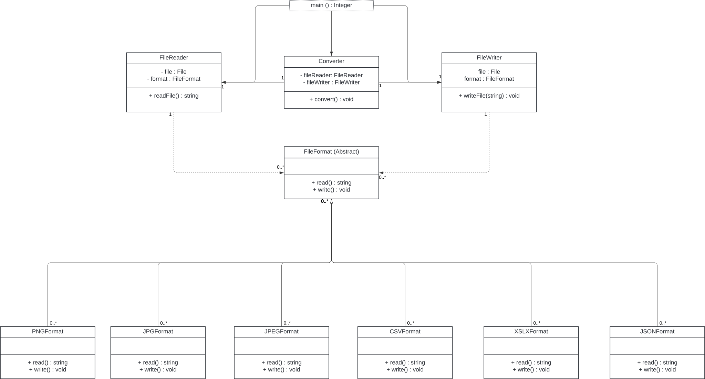

# CLI File Converter in C++

# Architecture



# File Converter Project

## Table of Contents

- [Introduction](#introduction)
- [Features](#features)
- [Prerequisites](#prerequisites)
- [Installation](#installation)
  - [macOS](#macos)
  - [Windows](#windows)
- [Building the Project](#building-the-project)
- [Usage](#usage)
  - [Examples](#examples)
- [Project Structure](#project-structure)
- [Troubleshooting](#troubleshooting)
- [Contact](#contact)

---

## Introduction

The **File Converter** is a C++ application that allows users to convert files between different formats. It supports both text-based formats (like CSV and JSON) and binary image formats (like PNG and JPEG). The application is designed following Object-Oriented Programming (OOP) principles and uses OpenCV for image processing.

---

## Features

- **Convert between image formats**: PNG, JPG, and JPEG.
- **Convert between text formats**: CSV and JSON.
- **Extensible architecture**: Easily add support for more formats.
- **Command-line interface**: Simple to use via terminal commands.
- **Cross-platform support**: Works on macOS and Windows.

---

## Prerequisites

- **C++ Compiler**: A compiler that supports C++11 or higher.
- **CMake**: Version 3.10 or higher.
- **OpenCV**: Version 4.x (for image processing).
- **Git**: For cloning the repository (optional).

---

## Installation

### macOS

#### 1. Install Homebrew (if not already installed)

Open Terminal and run:

```bash
/bin/bash -c "$(curl -fsSL https://raw.githubusercontent.com/Homebrew/install/HEAD/install.sh)"
```

#### 2. Install OpenCV via Homebrew

```bash
brew update
brew install opencv
```

#### 3. Verify OpenCV Installation

```bash
brew info opencv
```

#### 4. Clone the Repository

```bash
git clone https://github.com/your-username/file-converter.git
cd file-converter
```

### Windows

#### 1. Install OpenCV

- Download OpenCV from the official website: [OpenCV Releases](https://opencv.org/releases/)
- Choose the Windows version and follow the installation instructions.

#### 2. Add OpenCV to System Path

- Add the OpenCV `bin` directory to your system's PATH environment variable.

#### 3. Install CMake

- Download and install CMake from: [CMake Download](https://cmake.org/download/)

#### 4. Clone the Repository

Open Command Prompt or PowerShell:

```bash
git clone https://github.com/your-username/file-converter.git
cd file-converter
```

---

## Building the Project

### Create Build Directory

From the root directory of the project:

```bash
mkdir build
cd build
```

### Run CMake

```bash
cmake ..
```

### Build the Project

```bash
make
```

**Note for Windows Users**:

- Use `cmake .. -G "MinGW Makefiles"` if using MinGW.
- Replace `make` with `mingw32-make` or `nmake` depending on your setup.

---

## Usage

The `file_converter` executable accepts input and output file paths, as well as optional arguments to specify the output format and path.

### Basic Command Syntax

```bash
./file_converter <input_file> -t <output_format> -p <output_path>
```

- `<input_file>`: Path to the input file.
- `-t <output_format>`: (Optional) Desired output format (`png`, `jpg`, `jpeg`, `csv`, `json`).
- `-p <output_path>`: (Optional) Path to save the output file.

### Examples

#### Convert PNG to JPEG

```bash
./file_converter input.png -t jpeg -p output.jpeg
```

#### Convert JPEG to PNG

```bash
./file_converter input.jpeg -t png -p output.png
```

#### Convert CSV to JSON

```bash
./file_converter data.csv -t json -p data.json
```

#### Convert JSON to CSV

```bash
./file_converter data.json -t csv -p data.csv
```

---

## Project Structure

```css
file-converter/
├── include/
│   ├── converter.h
│   ├── fileformat.h
│   ├── formatters/
│       ├── csvformat.h
│       ├── jsonformat.h
│       ├── jpegformat.h
│       ├── jpgformat.h
│       └── pngformat.h
├── src/
│   ├── main.cpp
│   ├── converter.cpp
│   ├── cli.cpp
│   ├── formatters/
│       ├── csvformat.cpp
│       ├── jsonformat.cpp
│       ├── jpegformat.cpp
│       ├── jpgformat.cpp
│       └── pngformat.cpp
├── CMakeLists.txt
└── README.md
```

- **include/**: Header files for classes and formatters.
- **src/**: Source code files for the application.
- **CMakeLists.txt**: Build configuration.
- **README.md**: Project documentation.


---


## Troubleshooting

### Common Issues

#### OpenCV Header Not Found

If you encounter errors like:

```go
fatal error: 'opencv2/opencv.hpp' file not found
```

Ensure that:

- OpenCV is installed correctly.
- The include paths are set properly in your build configuration.

#### Undefined Reference Errors

If linker errors occur related to OpenCV functions:

- Ensure you're linking against OpenCV libraries in your `CMakeLists.txt`.

### Updating `includePath` for VSCode

If you see the error:

```
cannot open source file "opencv2/opencv.hpp"
```

In VSCode, update your `c_cpp_properties.json` file to include the correct path for OpenCV:

1. Open `.vscode/c_cpp_properties.json`.
2. Add the path to OpenCV headers, for example:

```json
{
    "configurations": [
        {
            "name": "Mac",
            "includePath": [
                "${workspaceFolder}/**",
                "/opt/homebrew/opt/opencv/include/opencv4"
            ],
            ...
        }
    ],
    "version": 4
}
```

---

## Contact

For any questions or issues, please open an issue on GitHub or contact [pruizalliata.ieu2022@student.ie.edu](mailto:pruizalliata.ieu2022@student.ie.edu).

---

**Enjoy converting your files!**